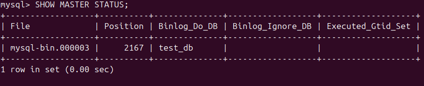
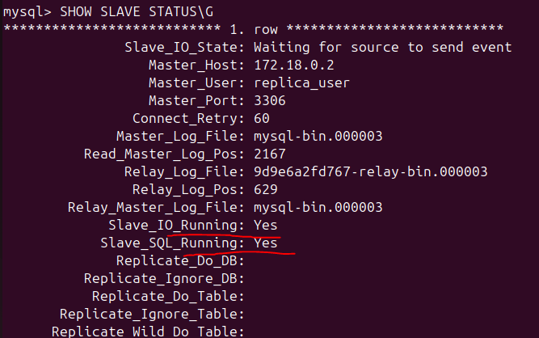
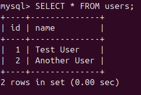
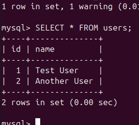
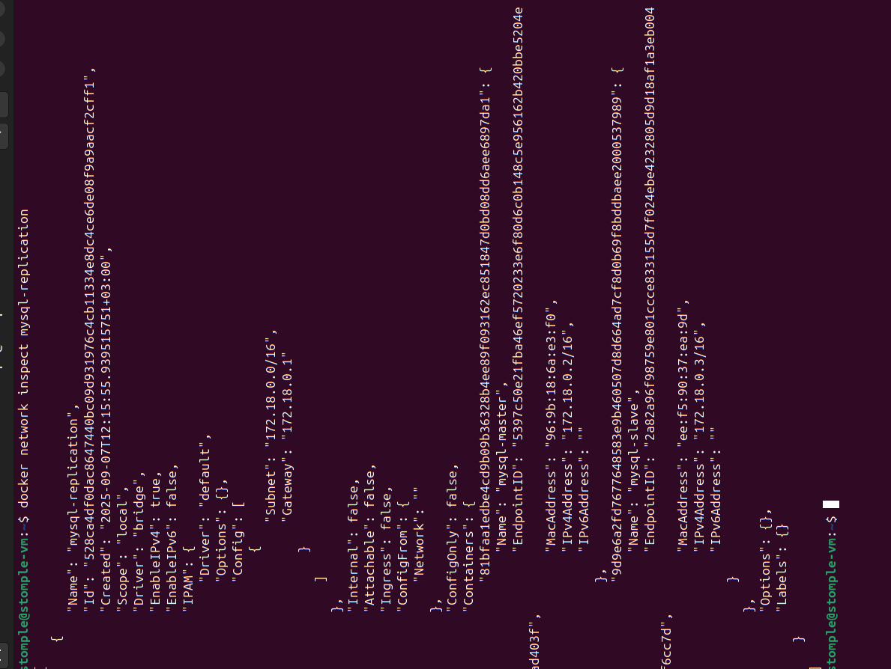

# Домашнее задание к занятию «Репликация и масштабирование. Часть 1» Соколов Тимофей

### Инструкция по выполнению домашнего задания

1. Сделайте fork [репозитория c шаблоном решения](https://github.com/netology-code/sys-pattern-homework) к себе в Github и переименуйте его по названию или номеру занятия, например, https://github.com/имя-вашего-репозитория/gitlab-hw или https://github.com/имя-вашего-репозитория/8-03-hw).
2. Выполните клонирование этого репозитория к себе на ПК с помощью команды `git clone`.
3. Выполните домашнее задание и заполните у себя локально этот файл README.md:
   - впишите вверху название занятия и ваши фамилию и имя;
   - в каждом задании добавьте решение в требуемом виде: текст/код/скриншоты/ссылка;
   - для корректного добавления скриншотов воспользуйтесь инструкцией [«Как вставить скриншот в шаблон с решением»](https://github.com/netology-code/sys-pattern-homework/blob/main/screen-instruction.md);
   - при оформлении используйте возможности языка разметки md. Коротко об этом можно посмотреть в [инструкции по MarkDown](https://github.com/netology-code/sys-pattern-homework/blob/main/md-instruction.md).
4. После завершения работы над домашним заданием сделайте коммит (`git commit -m "comment"`) и отправьте его на Github (`git push origin`).
5. Для проверки домашнего задания преподавателем в личном кабинете прикрепите и отправьте ссылку на решение в виде md-файла в вашем Github.
6. Любые вопросы задавайте в чате учебной группы и/или в разделе «Вопросы по заданию» в личном кабинете.

Желаем успехов в выполнении домашнего задания.

---

### Задание 1

На лекции рассматривались режимы репликации master-slave, master-master, опишите их различия.

*Ответить в свободной форме.*

Master-Slave:
Один главный (Master) – только он принимает запись.
Один или несколько подчинённых (Slave) – только читают копию данных.
Master-Master:
Все серверы – главные. Каждый может и писать, и читать.

Master-Slave — для чтения, Master-Master — для надёжности, но он сложнее.

---

### Задание 2

Выполните конфигурацию master-slave репликации, примером можно пользоваться из лекции.

*Приложите скриншоты конфигурации, выполнения работы: состояния и режимы работы серверов.*

SHOW MASTER STATUS:

SHOW SLAVE STATUS\G:

SELECT * FROM users на мастере:

SELECT * FROM users на реплике:

Сетевые настройки:

Конфигурация мастера:

docker run --name mysql-master --network mysql-replication \
  -e MYSQL_ROOT_PASSWORD=root \
  -e MYSQL_DATABASE=test_db \
  -p 3306:3306 \
  -d mysql:8.0 \
  --server-id=1 \
  --log-bin=mysql-bin \
  --binlog_do_db=test_db

Конфигурация реплики:

docker run --name mysql-slave --network mysql-replication \
  -e MYSQL_ROOT_PASSWORD=root \
  -e MYSQL_DATABASE=test_db \
  -p 3307:3306 \
  -d mysql:8.0 \
  --server-id=2 \
  --log-bin=mysql-bin \
  --binlog_do_db=test_db
